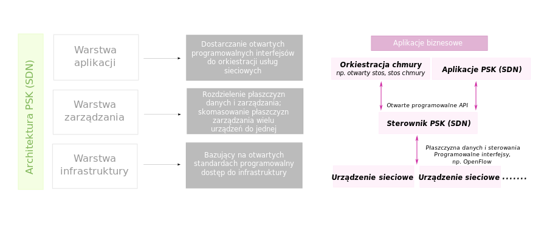

# Koncepcja SDN

Opracował: Paweł Miczka

## Nowe spojrzenie na projektowanie, wdrażanie oraz zarządzanie sieciami

SDN jest to skrót od Software Defined Networking. Oznacza to, że zarządzanie sieciom odbywa się poprzez centralną aplikację zwaną kontrolerem.  Takie rozwiązanie ma potencjał, by zmienić świat sieci, a większość osób z branży IT z dużym entuzjazmem podchodzi do tej koncepcji. SDN zmienia sposób patrzenia na urządzenia sieciowe. Znaczenie traci funkcjonalność i kompatybilność poszczególnych urządzeń ze sobą.

## OpenFlow

Najpopularniejszą specyfikacją dziś do tworzenia tego typu rozwiązań jest OpenFlow. Umożliwia on administratorom między innymi zdalne zarządzanie tablicą routingu w sieci. Co oznacza również iż administrator ten jest w stanie programować sieć, kontrolować i modyfikować aplikacje w sieciach oraz sterować ruchem. Administrator ten może kształtować ruch z centrali bez logowania się do poszczególnych przełączników.

## Wirtualizacja

SDN w większym stopniu przypomina serwery wirtualne. W obu przypadkach mamy do czynienia z jakimś centralnym oprogramowaniem, które zarządza całą infrastrukturą. W przypadku SDN warstwa abstrakcji umożliwia centralnemu serwerowi komunikację z różnymi kontrolowanymi przez niego urządzeniami sieciowymi. Taka warstwa jest potrzebna, ponieważ sprzęt sieciowy może działać pod kontrolą różnych wersji systemów operacyjnych czy pochodzić od różnych producentów. Wykonanie jakiejś określonej czynności w tym przypadku jest inicjowane za pomocą różnych poleceń. Natomiast warstwa wirtualizacji rozwiązuje ten problem, tłumacząc polecenia otrzymywane od kontrolera.

## Kontrolery

SDN to głównie kontrolery. To na nich są uruchamiane aplikacje do sterowania urządzeniami. Po drugie to on pośredniczy między programem, a urządzeniem wykorzystując do tego protokó OpenFlow.    

## Architektura
Architektura SDN jest przedstawiona na poniższym obrazku

Architektura SDN jest warstwowa. W skład tych warstw wchodzą:
- warstwa aplikacji,
- warstwa zarządzania
- warstwa infrastruktury

## Podsumowanie

Koncepcja SDN ma przyszłość. Głównie ze względu na ułatwienie skalowalności sieci oraz konserwację danych i usług. Jest to koncepcja nowa dlatego też niewiele jest firm, które wprowadzają w swój zakres usług tak świeżą technologię. Na razie Software Defined Networking można zobaczyć głównie na prezentacjach, zaś aktualna sytuacja przywodzi na myśl początki protokołu IPv6 czy też początki MPLS. Potrzeba zatem czasu, by firmy zechciały wejść w rynek "Programowalnej Sieci Komputerowej"

### Źródła:
- https://wikipedia.org
- https://crn.pl