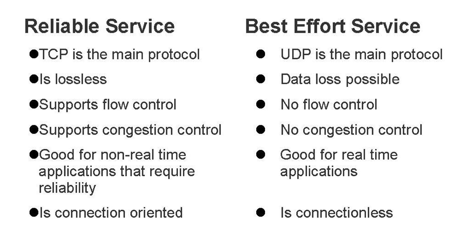
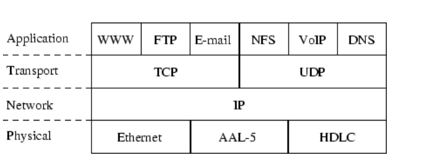
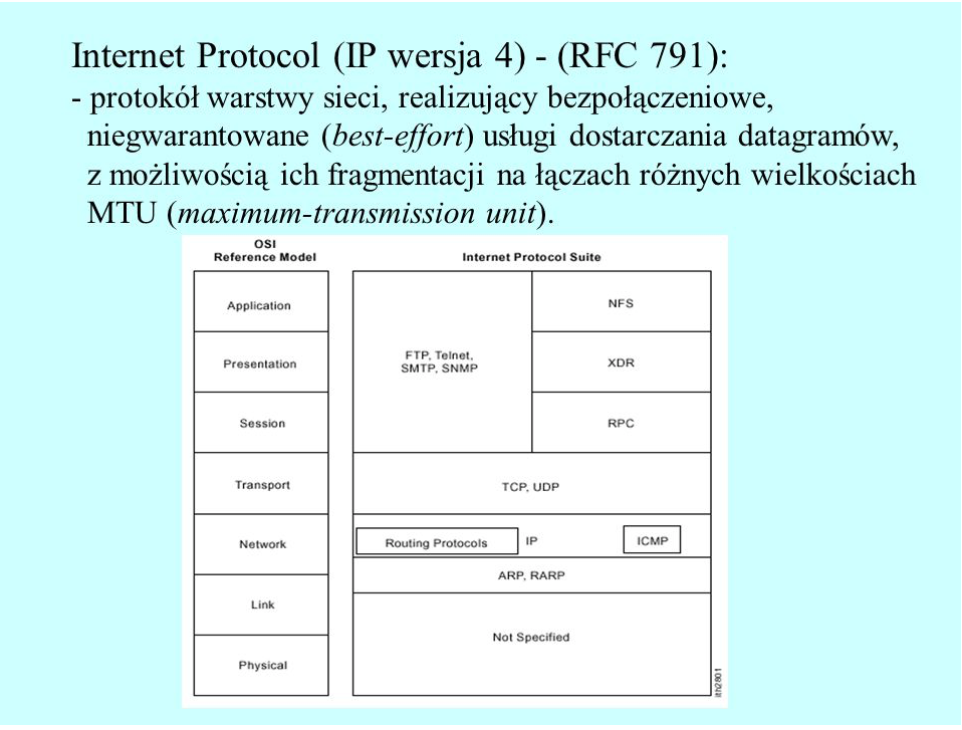

# Best Effort

**Zarzadzanie transmisja danych  przy uzyciu modelu  Best Effort**

## Definicja - Wikipedia:

Usluga �Best effort �(BES) transmituje dane w sieci o mozliwie najwyzszej przepustowosci
ale za to bez gwarancji poziomu uslug QoS .Jest to standardowy spos�b postepowania z kolejkami
pakiet�w w Internecie. Pakiety sa wysylane w kolejnosci naplywania i sa wysylane tak 
szybko jak to tylko mozliwe.

## OPIS

sieci IP sa czesto okreslane jako �Best Effort�  . Odnosi sie to do podejscia zapewnienia jakosci 
 gdzie sama sieci nie rozr�znia jakosci i typu  danych lecz stosowane uslugi juz tak. 
W technologii Best effort  wszystkie pakiety IP sa traktowane jednakowo. Siec �dokonuje� wszelkich
 staran aby dostarczyc  kazdy pakiet jak szybko mozliwe bez jednoczesnej korekcji bled�w.

Mozemy wyr�znic 2 gl�wne typy uslug stosowanych w zarzadzaniu jakoscia transmisji.
Rys1. W jezyku Angielskim kr�tkie por�wnanie 2 typ�w uslug : Jakosciowych i  �Best Effort

1.	Zorientowane na jakosc : ten typ sieci oferuje  dobra , niezawodna komunikacje .
        Oznacza to ze ze kazdy bajt danych musi byc dostarczony do odbiorcy w prawidlowej 
        kolejnosci  bez utraty danych  , zakl�cen ewentualnie niemozliwych do korekcji bled�w.

2.	Zorientowane  na  predkosc i brak op�znien czyli Best Effort. Siec bedzie pr�bowala
        dostarczyc strumien danych najszybciej jak to mozliwe bez korekcji bled�w , ponownej 
        wysylki pakiet�w.Oznacza to ze raz wyslany pakiet lecz nie otrzymany jest tracony bezpowrotnie.
         Podstawowajednostka transferu jest UDP - user data protocol.  

## Szczegoly

UDP  protokol. :User Datagram Protocol (UDP) jest protokolem komunikacyjnym Najprostszym �Transport Layer � 
z  pakietu protokol�ww TCP / IP. Polega ona maksymalnej  prostocie  komunikacji. 
O UDP m�wi sie zawodnym protokolem transportowy lecz korzysta z uslug IP, zapewniajaca najlepsza
 mozliwa komunikacje - Best  effort.
Z tych powod�w wiekszosc aplikacji VoIP uzywa UDP do transmisji danych glosowych. 
UDP jest cienka warstwa na wierzchu IP, kt�ra to spos�b rozr�zniania miedzy wieloma programami 
uruchomionymi na jednym komputerze. UDP r�wniez dziedziczy wszystkie wlasciwoscci TCP IP, 
kt�re usiluje ukryc. UDP jest zatem r�wniez pakietem opartym, obsludze , best-effort.

*UDP  jest zatem podstawowym skladnikiem sieciowej transmisji danych opartej na usludze BEST EFFORT*

Wlasciwosci:

- UDP jest uzywany, gdy potwierdzenie dostarczenia  danych nie jest wymagane

- UDP jest dobrym protokolem dla przeplywu danych w jednym kierunku.

- UDP jest prosty i nadaje sie do komunikacji na podstawie zapytania.

- UDP nie jest zorientowany na polaczenie.

- UDP nie przewiduje mechanizmu kontroli przeciazenia.

- UDP nie gwarantuje dostarczenia zam�wionych danych.

- UDP jest bez stanowy.

Protok�l UDP jest odpowiednia dla aplikacji strumieniowych, takich jak VoIP, 
przesylanie strumieniowe multimedi�w.

*Nagl�wek UDP zawiera 4 podstawowe parametry:*
-16 bit  pakiet do identyfikacji zr�dla pakietu
-16 bit informacja o porcie docelowym  sluzaca takze  do  identyfikacji aplikacji
-UDP pakiet jest  wlaczajac nagl�wek jest 16 bit  , minimalna wartosc 8 bit.
-Suma kontrolna generowana przez nadawce  przed wyslaniem  IPv4 ma to pole opcjonalne.

